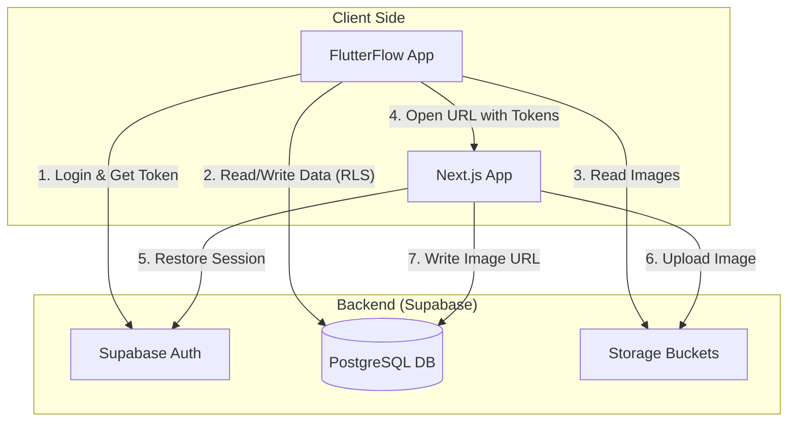
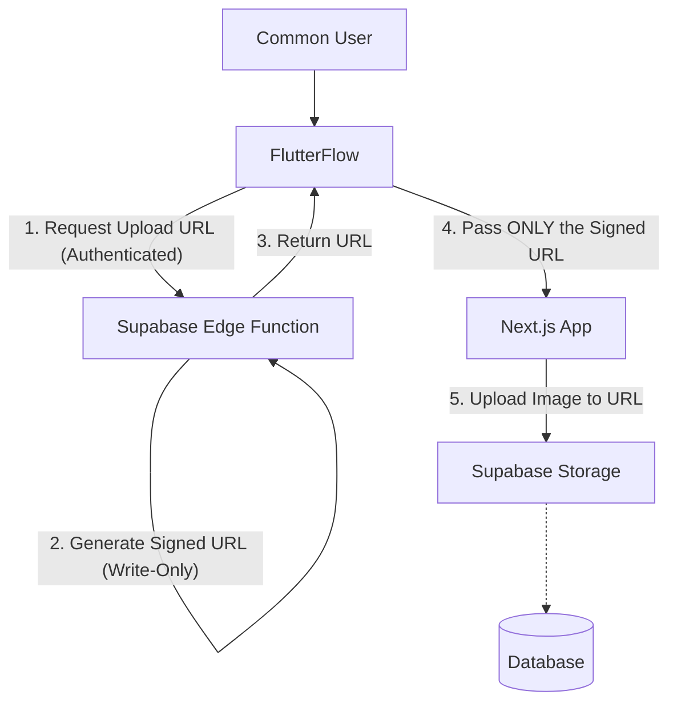

# システム構成とセキュリティ分析 (v1)

FlutterFlowアプリとNext.jsアプリの連携アーキテクチャ、およびセキュリティへの影響についての解説資料（第1版）です。

## 1. システム構成図 (Architecture)

FlutterFlowとNext.jsは、**Supabaseを共通のバックエンド（認証・DB・ストレージ）として共有**しています。

### 連携の仕組み
1.  **FlutterFlow**: ユーザーがログインし、Supabaseから `Access Token` と `Refresh Token` を取得します。
2.  **Token Handoff**: FlutterFlowはNext.jsのURLを開く際、URLフラグメント（`#`以降）にこれらのトークンを付与して渡します。
    *   例: `https://.../sync#access_token=...&refresh_token=...`
3.  **Next.js**: `sync` ページでURLからトークンを読み取り、`supabase.auth.setSession()` を使って自身のSupabaseクライアントを「ログイン状態」にします。
4.  **Shared State**: これにより、FlutterFlowとNext.jsは「同一ユーザー」としてSupabaseにアクセスできるようになります。

---

## 2. 各アプリの設定 (Configuration)

| 項目 | FlutterFlow | Next.js |
| :--- | :--- | :--- |
| **Supabase SDK** | 内蔵機能を使用 | `supabase-js` を使用 |
| **認証キー** | `Anon Key` (Public) | `Anon Key` (Public) |
| **認証状態の管理** | アプリ内で自動管理 | `setSession` で手動復元し、Cookie/Storageで維持 |
| **カスタム機能** | `getRefreshToken` (Custom Action) でトークン抽出 | `/sync` ページでトークン受領・セッション復元 |
| **CORS設定** | 特になし（モバイル/Web） | Supabase側でドメイン許可が必要 |

---

## 3. データベースセキュリティ (Database Security)

現在のセキュリティモデルは **SupabaseのRLS (Row Level Security)** に依存しています。これに変更はありません。

*   **原則**: クライアント（FlutterFlow/Next.js）が `Anon Key` という「誰でも使えるキー」でアクセスしてきますが、Supabase側で「誰がどのデータを触れるか」を厳密に制御します。
*   **実装**:
    *   `auth.uid()`: アクセスしてきたユーザーのID。
    *   **Policy**: 「`user_id` カラムが `auth.uid()` と一致する行のみ SELECT/INSERT/UPDATE 可能」というルールをDBに強制します。
    *   これにより、クライアントアプリが改ざんされても、他人のデータにはアクセスできません。

---

## 4. セキュリティ影響分析 (Security Impact Analysis)

「FlutterFlowのみ」の構成から「FlutterFlow + Next.js」構成にしたことによる、セキュリティリスクの変化について解説します。

### 脆弱性の変化比較

| 観点 | FlutterFlowのみ | FlutterFlow + Next.js追加後 | 評価 |
| :--- | :--- | :--- | :--- |
| **認証基盤** | Supabase Auth | Supabase Auth (共有) | **変化なし**   同じ認証基盤を使用しており、堅牢性は変わりません。 |
| **アクセス権限** | RLSで制御 | RLSで制御 | **変化なし**   Next.jsからアクセスしても、RLSがある限り「自分に関するデータ」以外は触れません。 |
| **トークン管理** | アプリ内メモリ/SecureStorage | アプリ内メモリ/Cookie/LocalStorage | **注意が必要**   トークンをURL経由で渡すため、その瞬間だけ露出リスクがあります。 |
| **攻撃面 (Attack Surface)** | FlutterFlowの画面操作のみ | Next.jsというWebアプリが追加 | **拡大**   Next.js側にXSS（クロスサイトスクリプティング）などのWeb特有の脆弱性があると、トークンが盗まれる可能性があります。 |

### 新たに発生するリスクと対策

1.  **トークン受け渡し時のリスク (Token Exposure)**
    *   **リスク**: URLにトークンが含まれるため、ブラウザの履歴やプロキシログに残る可能性があります。
    *   **現状の対策**: URLパラメータ (`?`) ではなく、**URLフラグメント (`#`)** を使用しています。フラグメントはサーバーに送信されないため、通信ログには残りません。Next.js側でも処理後に即座にURLをクリア（リダイレクト）しています。

2.  **Webアプリ側の脆弱性 (XSS)**
    *   **リスク**: Next.jsアプリに悪意のあるスクリプトが埋め込まれる脆弱性 (XSS) があった場合、ブラウザ内のトークンが抜き取られる恐れがあります。
    *   **対策**: Next.js (React) はデフォルトでXSS対策が強力ですが、`dangerouslySetInnerHTML` などを不用意に使わないよう注意が必要です。

3.  **CORS設定**
    *   **リスク**: Supabaseへのアクセス許可ドメインが増えます。
    *   **評価**: 許可しているのはご自身の管理するドメインのみであれば、リスクは限定的です。

### 結論

**「ログインしたユーザーは自分に関するデータベースを自由に編集できる」という前提においては、セキュリティレベルは大きく低下しません。**

最も重要な防壁は **「SupabaseのRLS (Row Level Security)」** です。
Next.jsアプリが追加されても、このRLSポリシー（「自分のデータしか触れない」）が正しく設定されている限り、Next.jsアプリが悪用されても「他人のデータを盗む・壊す」ことはできません。

**追加のリスクは主に「Webアプリ（Next.js）自体の堅牢性」に依存します**が、一般的なWebアプリ開発のプラクティス（適切なライブラリ使用、HTTPS利用など）を守っていれば、プロトタイプとして許容範囲内の構成と言えます。

---

## 5. 高度なセキュリティ対策 (Advanced Security Hardening)

プロダクト版に向けた、「データの流出リスクを極限までゼロに近づける」ための追加対策と検討事項です。

### A. トークン露出リスクとXSS対策の強化

現在の「URLフラグメントでトークンを渡す」方式は標準的ですが、万全を期すための対策です。

1.  **CSP (Content Security Policy) の導入**
    *   Next.jsアプリ側で「読み込み可能なスクリプトのドメイン」を厳格に制限します。
    *   万が一XSS脆弱性があっても、外部サーバーへのデータ送信をブラウザレベルでブロックできます。
2.  **HttpOnly Cookieの利用検討**
    *   現在はクライアントサイド(`supabase.auth.setSession`)でセッションを復元していますが、Next.jsのMiddleware (SSR) で処理し、トークンをJavaScriptからアクセスできない `HttpOnly Cookie` に保存する方式に変更することで、XSSによるトークン奪取を完全に防げます。

### B. [Deep Dive] "Write-Only" アーキテクチャの検討

> **提案**: 「Next.jsアプリにユーザー識別符号のみを送り、Next.js側にはINSERT/UPDATEのみの権限を与える」ことで、データ流出リスクをゼロにできないか？

このアイデアはセキュリティの原則「最小権限の原則 (Principle of Least Privilege)」に則っており、非常に有効です。ただし、「ユーザー識別符号（User ID）のみ」を送る場合は、「なりすまし」を防ぐための署名が必要です。

実現のための具体的なアーキテクチャ案（**Pre-signed URL方式**）を提示します。

#### 新・提案アーキテクチャ: Pre-signed Upload URL

Next.jsアプリに「ユーザーの全権限を持つトークン」を渡すのではなく、**「画像アップロードだけができる使い捨てURL」** を渡します。

#### この構成のメリット（データ流出リスクゼロ）

1.  **Next.jsは「トークン」を持たない**
    *   Next.jsに渡されるのは `https://...supabase.co/storage/.../upload?token=xyz...` という長いURLだけです。
    *   このURLは「特定の場所にファイルを1つ置く」権限しか持ちません。
2.  **Read権限が物理的にない**
    *   このURLを使ってデータベースを検索（SELECT）したり、他のファイルを読んだりすることはシステム的に不可能です。
    *   万が一Next.jsが乗っ取られても、攻撃者は「ダミー画像をアップロードする」ことしかできず、**情報流出は100%発生しません。**
3.  **なりすまし不可能**
    *   URLの発行はFlutterFlow（認証済み）からのリクエスト時のみ、サーバーサイド（Edge Function）で行われます。Next.jsが勝手にURLを作ることはできません。

#### 結論
「ユーザーIDだけを送る」というアイデアを技術的に安全に実装するなら、この **「署名付きアップロードURL (Pre-signed URL) 方式」** が最適解です。これにより、Next.jsアプリを「書き込み専用の端末」として扱い、データ流出リスクを構造的に排除できます。
